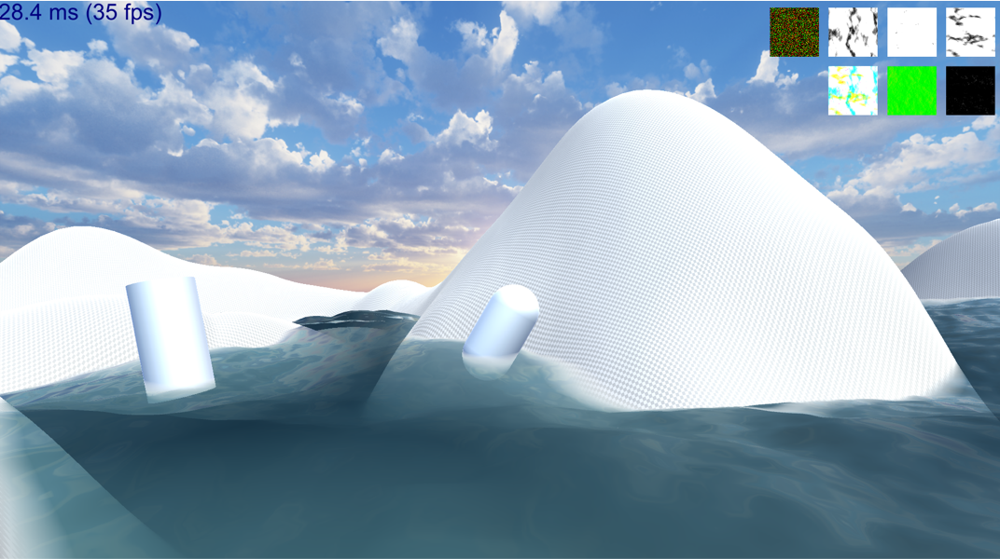

# 基于 Unity3D 的实时可交互海面构建系统

## 基于 FFT 构建海面网格

## 基础光照模型

## 菲涅尔视效

## 开启深度检测和岸边白沫

## 船只交互产生水波

## 参考资料

- *Simulating Ocean Water*, Jerry Tessendorf 
- *Wave Particles*, Cem Yuksel, Donald H. House, John Keyser
- *Mathematics for 3D Game Programming and Computer Graphics Third Edition*, Eric Lengyel
- https://developer.unity.cn/projects/5e47b3f5edbc2a01ba0a23df
- https://zhuanlan.zhihu.com/p/95482541

